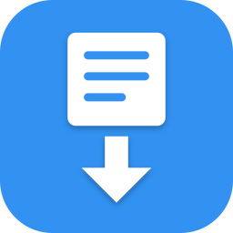
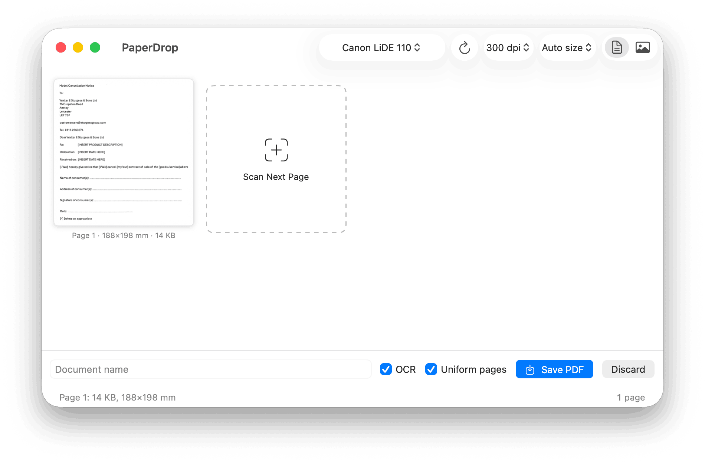

<div align="center">



# PaperDrop

**A tiny native macOS scanner app that turns paper into searchable,
archival PDFs — one big button, ~20 KB per page.**

[](https://github.com/bensquire/PaperDrop/actions/workflows/ci.yml)
[](https://github.com/bensquire/PaperDrop/actions/workflows/release.yml)
[](https://github.com/bensquire/PaperDrop/releases/latest)
[](https://www.apple.com/macos/)
[](https://swift.org)
[](LICENSE)

[**Download latest →**](https://github.com/bensquire/PaperDrop/releases/latest) ·
[Releases](https://github.com/bensquire/PaperDrop/releases)

<br/>



</div>

Scan a page, get a page card. Scan a few more, drag them into order, name
the document, hit Save — a compressed, OCR-searchable PDF lands in
`~/Documents/Scans` and Finder shows it to you. That's the whole app,
on purpose.

## What it does

- **Tiny archival PDFs** — pages are thresholded to pure black & white
  (Otsu), cleaned of scanner-bed edges and dust, and stored as CCITT G4
  fax compression inside the PDF: **~20 KB per A4 page** at 300 dpi.
- **Searchable** — an invisible text layer via Apple's Vision OCR makes
  every PDF findable in Spotlight and searchable in Preview. No cloud,
  no external OCR tools.
- **Knows what paper you used** — auto-detects and snaps to A4 / A5 /
  A6 / Letter (metric wins ties), or force a size from the toolbar
  (A4, A5, 4×6″, 5×7″, 8×10″, Letter). Multi-page documents can be
  padded to a uniform page size, preserving each page's original layout.
- **Photo mode** — grayscale JPEG pages for photos, pencil, and anything
  hard black-and-white would destroy.
- **Two scanner backends** — Apple's ImageCaptureCore for anything macOS
  supports natively (including AirScan/eSCL network scanners), and SANE
  for legacy USB scanners whose vendor drivers died years ago. Same
  physical device visible through both? It's deduplicated and the
  working backend wins.
- **Battle-hardened against cranky hardware** — per-scan forced
  calibration, stale-USB-address re-resolution with retry, automatic
  release of legacy vendor drivers that grab exclusive USB ownership,
  and a Cancel button that software-resets the scanner (a programmatic
  unplug/replug) instead of leaving it wedged.
- **Batteries included** — the full SANE stack (all 85 backends) ships
  inside the app, so legacy USB scanners work straight from the DMG
  with zero installs. The app itself is pure Swift on system frameworks;
  ~17 MB all-in.

## Install

Grab the DMG from the [latest release](https://github.com/bensquire/PaperDrop/releases/latest),
drag PaperDrop into Applications. Signed and notarized — first launch is
silent. Nothing else to install, even for ancient USB scanners.

## Build from source

Xcode plus — for the bundled scanner stack — a one-time
`brew install sane-backends` (its binaries get vendored and relocated
into the app by `scripts/vendor-sane.sh`). No third-party Swift
dependencies.

```sh
git clone https://github.com/bensquire/PaperDrop.git
cd PaperDrop
make bundle                 # vendors SANE, builds + signs PaperDrop.app
open PaperDrop.app
```

## Development

```sh
make test      # XCTest suite over the ScanKit pipeline (AAA style)
make lint      # Apple's toolchain-bundled `swift format` in lint mode
make format    # auto-format
make release   # signed DMG (+ notarization if a `paperdrop` keychain
               # profile is stored)
```

A pre-commit hook (`git config core.hooksPath .githooks`) runs lint +
tests + a Python compile check.

## Project layout

```
Package.swift              # SwiftPM: ScanKit lib + app + CLI
Sources/ScanKit/           # The engine — reusable, UI-free
├── Pipeline.swift         #   Otsu, cleanup, crop, paper-size snap
├── G4.swift               #   CCITT G4 via ImageIO + TIFF stream extraction
├── PDFWriter.swift        #   minimal PDF writer (G4 + JPEG + OCR layer)
├── OCR.swift              #   Vision text recognition
├── ICCBackend.swift       #   ImageCaptureCore scanner backend
├── SANECLIBackend.swift   #   SANE backend + scanner-reliability lore
└── USBReset.swift         #   software unplug/replug via IOUSBHost
Sources/PaperDrop/         # SwiftUI app
Sources/scantool/          # headless CLI test harness
Tests/ScanKitTests/        # unit tests
icon/makeicon.swift        # generates the app icon from code
scripts/                   # vendor-sane.sh, make-dmg.sh
.github/workflows/         # ci.yml (lint+test+smoke), release.yml (signed DMG)
```

## How a page becomes 20 KB

1. Scan grayscale at 300 dpi (the OCR sweet spot) via the selected
   backend.
2. **Otsu threshold** to 1-bit, then connected-component cleanup: ink
   touching the scan border is bed-edge shadow (removed), specks under
   4 px are dust (removed).
3. **Content-cluster crop** — ink is dilated so paragraphs merge into
   blobs; every blob with meaningful ink survives (a lone signature box
   far below a table is content, a fleck isn't). Outlier tails holding
   <0.3% of ink can't veto the paper-size decision.
4. **Paper-size snap** to the nearest standard size, anchored so content
   keeps its physical position on the page.
5. **CCITT G4** encoding (ImageIO), embedded losslessly in a
   hand-rolled PDF writer, plus the Vision OCR words as an invisible,
   position-matched text layer.

## Releasing

```sh
# one-time: add 6 GitHub Secrets (cert, password, team ID, 3× notary creds)
git tag v0.1.0 && git push origin v0.1.0
# → GitHub Actions lints, tests, builds, signs (Developer ID), notarizes
#   app + DMG, staples both, and publishes a GitHub Release.
```

Secret names match my other repos (AudiobookForge) — see the header of
[.github/workflows/release.yml](.github/workflows/release.yml).

## License

**[MIT](LICENSE)** — use it, fork it, ship whatever; just keep the
copyright notice.

### Third-party components

Release builds bundle the **SANE** scanner stack (`scanimage`, `libsane`,
and all backends) from [sane-project](https://gitlab.com/sane-project/backends),
relocated into the app by `scripts/vendor-sane.sh`. SANE is **GPL v2**
(backends carry a linking exception); it runs as a separate helper
process, so PaperDrop's own source remains MIT. The GPL license texts
ship inside the app at `Contents/Resources/licenses`, and each release's
notes state the exact bundled version with upstream source links.
